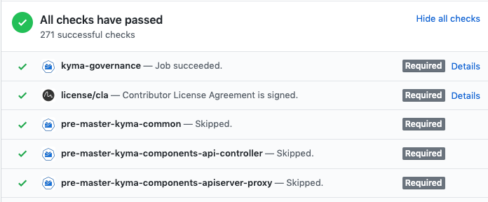

# Update component and its chart in one pull request

Created on 2019-23-04 by Adam Szecowka (@aszecowka) and Pawel Kosiec (@pkosiec). 

## Status
Proposed on 2019-23-04.

## Motivation
Currently, when a developer introduces changes to his component, he needs to do at least 2 PR:

- Changes made to the component
- Bump image version in the chart

Such an approach has many drawbacks:

- Slow development cycle, dealing with 2 PRs, asking for approvals twice
- A developer can forget to bump image and version can be updated only on the release day. Updating version on the release day is 
the worst case scenario because we postponed integration of our components. This is against Continuous Integration approach.
- The code in the repository does not reflect what is really running.
- Ugly repository history. Many commits only bump the component's image version.

## Goal
- Kyma developer can introduce his changes to Kyma in one Pull Request. Changes to the component and helm chart where we update component version is done in the same PR.
- The code in the Kyma repository reflects code executed on the Kyma.
When doing a release we rebuild all components. We should not be surprised on the release day that some tests are failing because some component was not updated for 3 weeks
- Kyma repository has a nice commit history and commits that only bumps a component version are rare.
- Run Kyma integration tests with the modified component within the same pull request status checks


## Proposed solution

**Allow using images built on Pull Requests on master branch**

Let assume that I am working on PR-1234. When I modify `componentA`, Presubmit jobs build Docker images. 
A tag of such image is the same as a pull request number.
A developer can use this version in a `values.yaml` file:
```
component_a:
  dir: pr/
  version: PR-1234
```

With this approach, Prow executes component's and integration's jobs for the same PR. We have to ensure the proper order of jobs,
to build components before using them in integration jobs. To achieve that, an additional step is required at the beginning of 
every integration jobs that waits for all dependent jobs.

To read more details, see [Guard integration jobs](#guard-integration-jobs).

In the beginning, we can use the described approach as an option, a developer can decide if he updates a code and chart in the same PR. 
As a next step, we can introduce a job that checks if a version of the chart is updated in the PR. To read more details, 
see [Job enforcing changes in one PR](#job-enforcing-changes-in-one-pr).


### Guard integration jobs
To postpone the execution of integration jobs, we should add an additional step at the beginning of every integration job.
To decide, if integration job can be executed, use statuses of given pull request:


Most of these statuses are sent by Prow and represents statuses of executing jobs.

The algorithm of Guard is following:
1. Fetch all required statuses sent by Prow for given PR that represents components build. 
2. If some status is marked as a failed, fail fast integration job. 
3. If all statuses are successful, continue integration job execution.
4. If waiting for statuses takes more than defined timeout (10min), fail integration job.
5. If some statuses are in Pending state, sleep for some time (15s) and go to point 1.

Ad Step 1. Guard filters statuses by its names. In Kyma Prow configuration, there is a convention for
job names. For example, every component job name for master branch starts with `pre-master-kyma-components-`.
Ad Step 2, Guard fails fast integration job to reduce the number of provisioned clusters and VMs.
Ad Step 4, Guard defines a timeout for checking jobs statuses. Prow defines a maximum number of concurrently executed jobs. 
There could be an extremely rare situation, that Prow executes only integration jobs that all wait for components jobs that cannot be executed because a maximum
number of concurrent jobs was reached. In such a case, a developer has to trigger an integration job manually. 

Working code for Guard can be found in [PR#904](https://github.com/kyma-project/test-infra/pull/904)

### Job enforcing changes in one PR
To require updating charts immediately, a new Presubmit job should be defined. Below you can find it's pseudocode:
```
- get component's changed in current PR (ignore markdown files)
- check if chart uses the current version. Use Makefile target "path-to-referenced-charts"
```
Still, there should be an option to merge a PR without updating a chart. In such a case, a PR should have the label, for
example: `postpone-integration` and Presubmit job described above should succeed immediately.   
